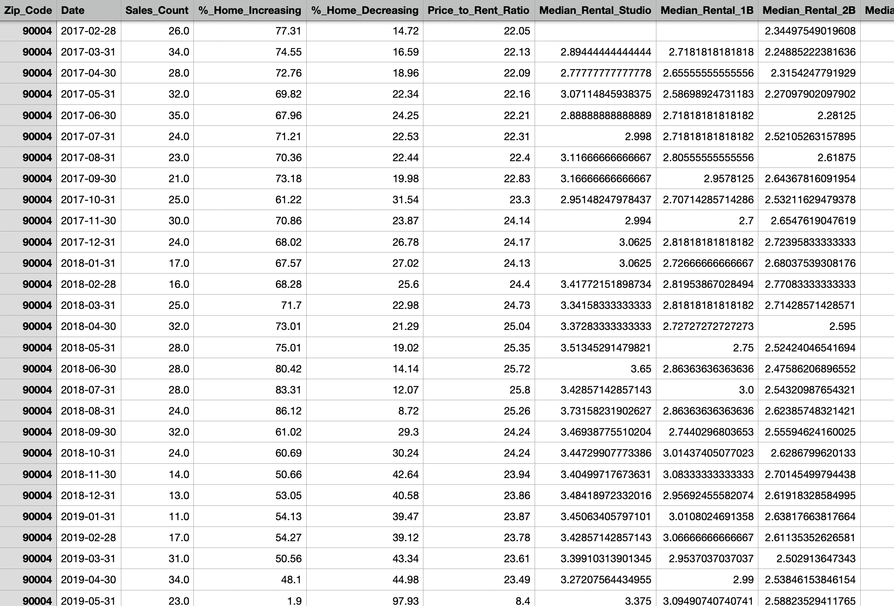
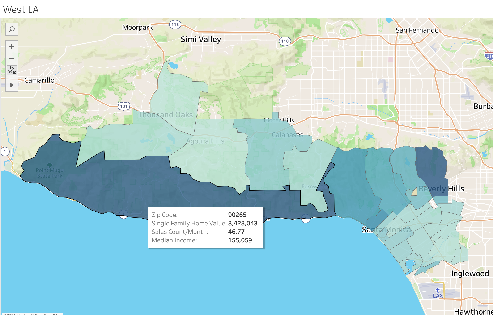

## Data Engineering Project MVP

I grabbed data for my Los Angeles real estate exploratory project from two sources: Zillow via Quandl's API calls and income data from government census data. Since I wanted a total of 24 "features" per zip code (ie Home Value per # of Bedrooms, Sales Counts per Month, etc) that are updated each month, I created a function that looped through 7 lists of zip codes for LA County that were divided up by region and grabbed these features to append to its corresponding dataframe. The resulting dataframe looks like this: 

I then converted all 7 of these dataframes into csv files as well as tables under a SQL database. I have all of these calls to grab data via the API, convert to a Pandas DataFrame, CSV file, and update my SQL db within two python notebooks that have been scheduled to update on the first of every month via cron job. 

In addition, I have started my Streamlit app. The data was inconsistent across the board with some zips providing data for all my features while some not providing any rental information so my hopes to analyze real estate data by looking at rental vs sale data had to be re-routed to some basic EDA and visualization. I hope to be able to allow the user to toggle between different maps of LA with interactive search filters and ability to look for specific real estate data plots for each zip code. I will also edit my Tableau dashboards to refresh its data sources once a month. 

