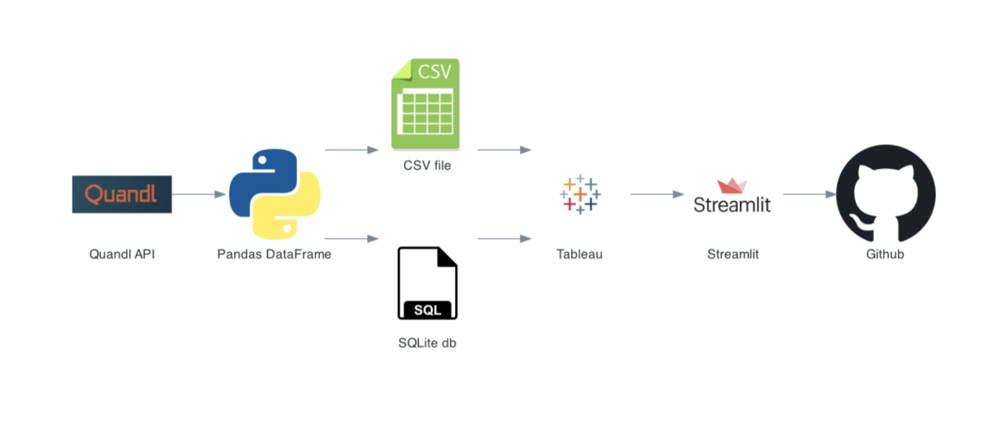
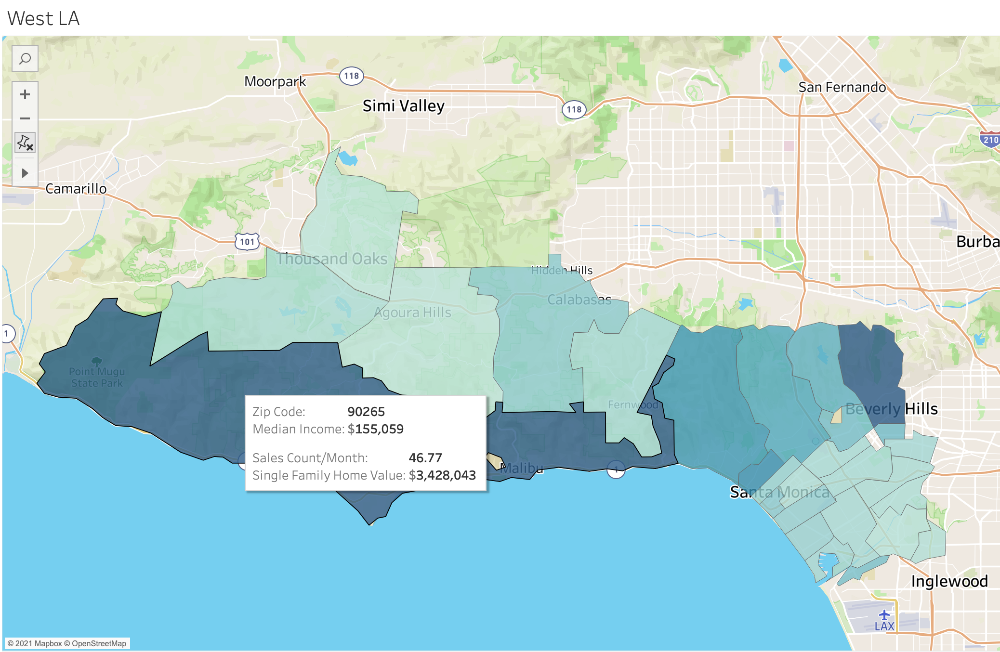
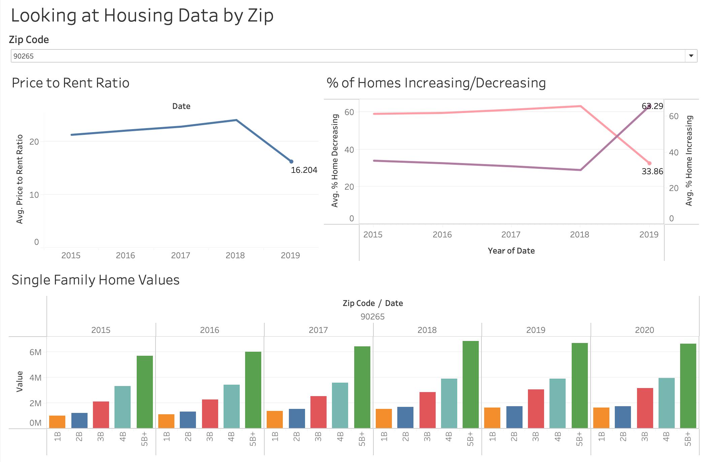

# Building an End to End Pipeline with LA Country Real Estate Data
Caroline Shi

## Abstract
I set out to build an end to end pipeline for LA County real estate data and create some meaningful EDA and visualizations for my findings -- particularly looking at the change in rental and sale data over time. In addition, I created a Streamlit application that displays interactive Tableau maps and dashboards that allow you to explore and filter data by region and zip code. Both the application and data source are updated using Cron Job on the first of each month. 

## Design 
Prospective home buyers are interested in gaining a more comprehensive view of the current real estate market in LA. Should they rent or buy right now? Which zip codes are a better fit for their current finances? Are certain areas of LA quickly increasing in value compared to others? 

How do we compile real estate data and visualize it in a meaningful and easily interpretable way for users? How do we get this data and update it on a regular basis? 

My project aims to address all of these concerns!

## Data
Through Quandl's API, I was able to extract real estate data from Zillow dating as far back as 2008. I divided LA County into 7 regions and grabbed data for a total of 254 zip codes. The data metrics were updated at the end of each month with some data more consistently updated than others. Due to the inconsistent nature of the data I extracted, I was unable to compare rental vs sale prices as in depth as I had hoped. The API offered over 80 different categories of data, of which I grabbed 25 as following: 

1. Sales Count
2. % of Home Value Increasing
3. % of Home Value Decreasing 
4. Price to Rent Ratio
5. Median Rent for Studios
6. Median Rent for 1B
7. Median Rent for 2B
8. Median Rent for 3B
9. Median Rent for Duplex/Triplex
10. Median Rent for Single Family Homes
11. Median Listing Price for 2B
12. Median Listing Price for 3B
13. Median Listing Price for 5B+
14. Median Listing Price for Duplex/Triplex
15. Median Listing Price for Single Family Homes
16. Median Sold Price for Condos
17. Median Sold Price for Single Family Homes
18. Home Value for 1B
19. Home Value for 2B
20. Home Value for 3B
21. Home Value for 4B
22. Home Value for 5B+
23. Home Value for Duplex/Triplex
24. Home Value for Single Family Homes

In addition, I grabbed median income data for LA County from the government census website. 

## Algorithms
* Workflow with monthly API calls and data updates via cron job: 

* Data Visualization and Dashboards via Tableau and Streamlit:

## Tools
* Quandl API for data calls
* Numpy, Pandas for wrangling and organising data, EDA
* SQLalchemy/SQLite for ingesting data into a SQL db 
* Tableau for data visualization/dashboards
* Streamlit for app deployment

